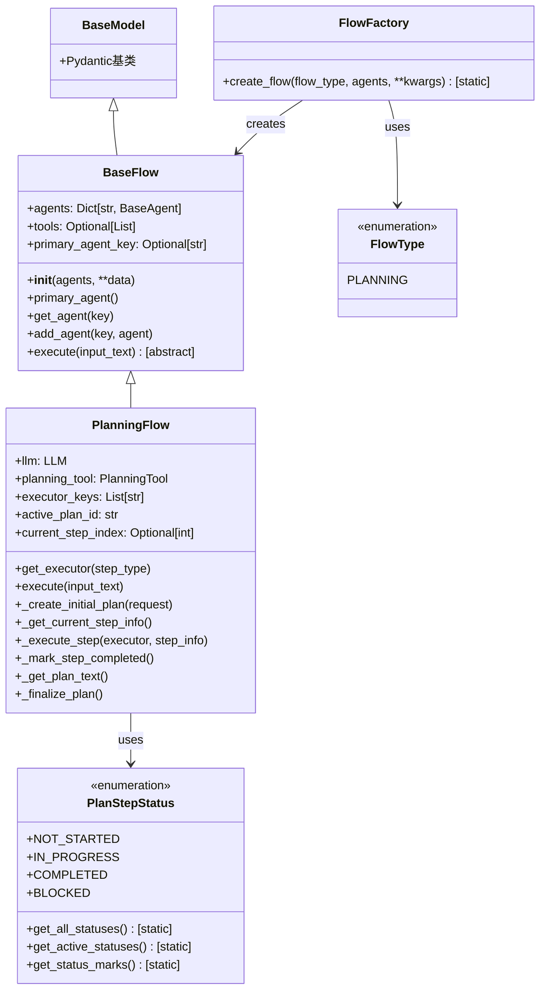
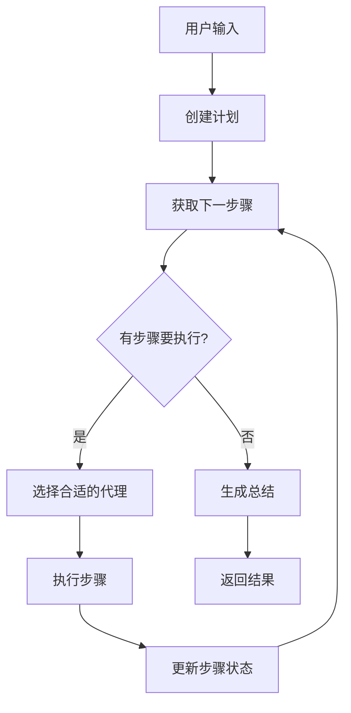
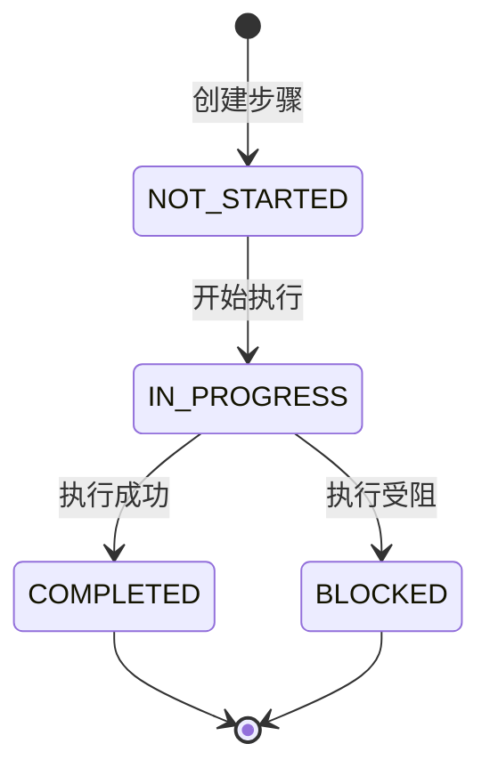
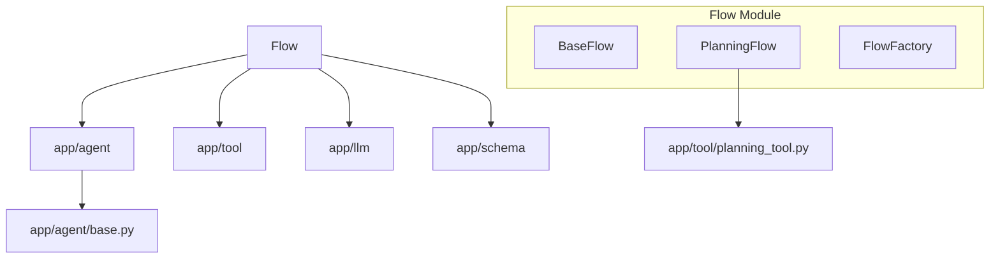
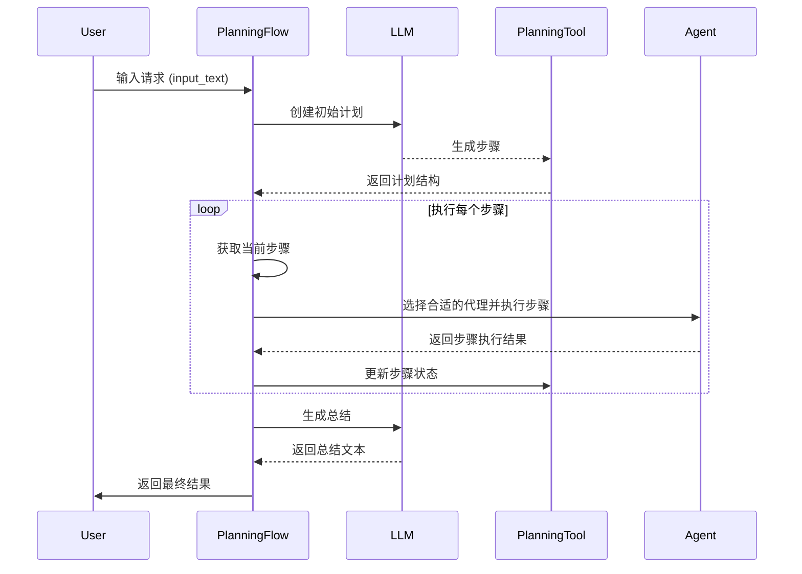

# Flow模块文档

## 模块概述

Flow（流程）模块是OpenManus项目的核心协调组件，负责管理和编排多个Agent（代理）的协作执行过程。该模块实现了一套流程管理框架，能够将复杂任务分解为有序的步骤，并选择合适的代理来执行每个步骤。其主要功能包括流程定义、任务规划、代理选择和执行监控等。目前，该模块重点实现了基于规划的流程（PlanningFlow），支持自动化的任务分解和执行。

## 核心组件

### 类层次结构



### 主要文件说明

1. **base.py**: 定义了`BaseFlow`抽象基类，是所有流程类型的基础。提供了代理管理、主代理获取和抽象执行方法。

2. **flow_factory.py**: 实现了`FlowFactory`类和`FlowType`枚举，使用工厂模式创建不同类型的流程实例。

3. **planning.py**: 实现了基于规划的流程`PlanningFlow`类和`PlanStepStatus`枚举，管理任务规划和执行。这是当前模块的核心实现，提供了任务分解、步骤执行和计划状态管理功能。

## 工作原理

Flow模块基于**任务分解与执行**的模式工作，将复杂任务拆分为可管理的步骤，并协调不同代理的执行：



### PlanningFlow执行流程

1. **初始化**: 创建流程实例，设置可用代理和执行器。

2. **计划创建**: 接收用户输入，使用LLM创建结构化的任务计划。

3. **步骤执行循环**:
   - 获取当前待执行的步骤
   - 为该步骤选择合适的执行代理
   - 执行步骤并收集结果
   - 更新步骤状态为已完成
   - 获取下一个步骤，重复执行

4. **计划完成**: 当所有步骤执行完毕，生成执行总结并返回结果。

### 步骤状态管理

步骤状态通过`PlanStepStatus`枚举管理，包括四种状态：



## 模块关系

Flow模块与其他模块的关系如下：



## 数据流向

流程执行过程中的数据流动如下：



## 扩展点

Flow模块提供了多个扩展点，可以通过以下方式扩展其功能：

1. **创建新的流程类型**: 继承`BaseFlow`类并实现`execute`方法，可以创建新的流程类型，然后在`FlowFactory`中注册。

2. **自定义步骤类型匹配**: 扩展`PlanningFlow.get_executor`方法，实现更复杂的步骤类型与代理匹配逻辑。

3. **增强计划生成**: 修改`_create_initial_plan`方法，改进计划生成算法和结构。

4. **添加新的步骤状态**: 扩展`PlanStepStatus`枚举，增加新的步骤状态类型。

5. **自定义执行策略**: 修改`execute`方法，实现不同的步骤执行策略和控制流程。

## 常见用例

1. **多步骤任务分解**: 将复杂任务分解为有序的步骤，并由不同代理逐一执行。

2. **智能工作流管理**: 自动创建和执行工作流，处理依赖关系和条件分支。

3. **协作问题解决**: 让多个专业代理协同工作，解决复杂问题。

4. **长期任务执行**: 管理需要长时间执行的任务，保持状态和进度。

5. **交互式流程**: 在执行过程中与用户交互，根据反馈调整计划和执行。

## 代码示例

### 创建并执行一个PlanningFlow实例

```python
from app.agent import Manus, BrowserAgent
from app.flow import FlowFactory, FlowType

async def run_flow():
    # 创建不同类型的代理
    manus_agent = await Manus.create()
    browser_agent = BrowserAgent()
    
    # 创建代理字典，指定用途
    agents = {
        "general": manus_agent,
        "browser": browser_agent
    }
    
    # 使用工厂创建PlanningFlow
    flow = FlowFactory.create_flow(
        flow_type=FlowType.PLANNING,
        agents=agents,
        executor_keys=["general", "browser"]  # 指定执行器顺序
    )
    
    # 执行流程
    result = await flow.execute("搜索最新的人工智能新闻并生成摘要")
    
    return result
```

### 扩展PlanningFlow添加新功能

```python
from app.flow.planning import PlanningFlow
from typing import Optional

class EnhancedPlanningFlow(PlanningFlow):
    """增强版规划流程，支持更智能的代理选择"""
    
    async def get_executor(self, step_type: Optional[str] = None) -> BaseAgent:
        """增强的代理选择逻辑，基于步骤关键词进行匹配"""
        # 基于步骤类型的智能匹配
        if step_type == "search" or "搜索" in step_info.get("text", ""):
            return self.agents.get("browser", self.primary_agent)
            
        # 基于步骤内容的代码相关任务检测
        if "代码" in step_info.get("text", "") or "编程" in step_info.get("text", ""):
            return self.agents.get("coding", self.primary_agent)
            
        # 默认使用父类的选择逻辑
        return await super().get_executor(step_type)
```
