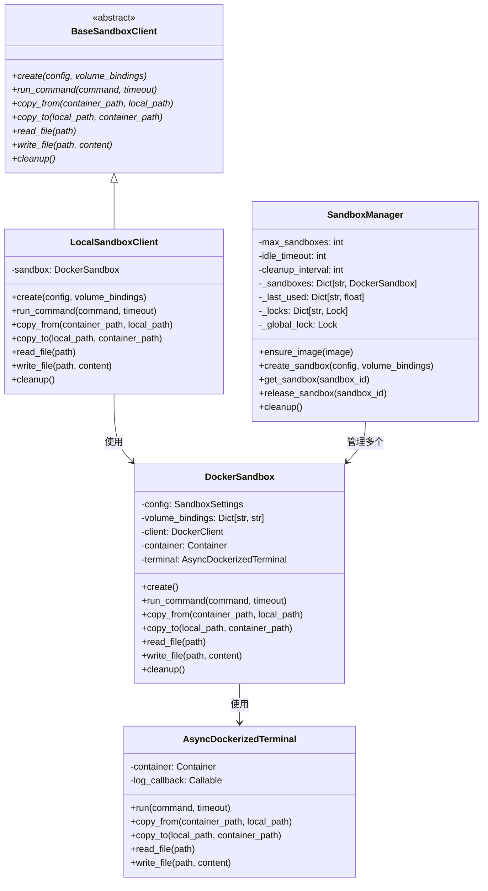
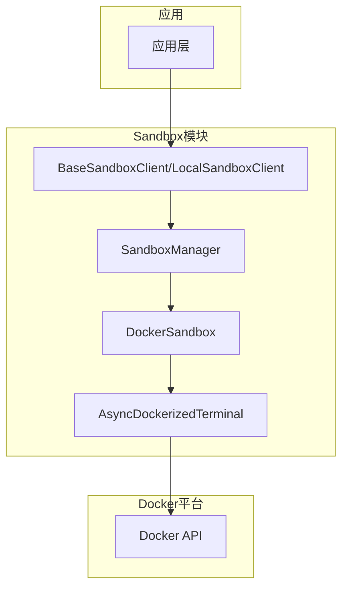
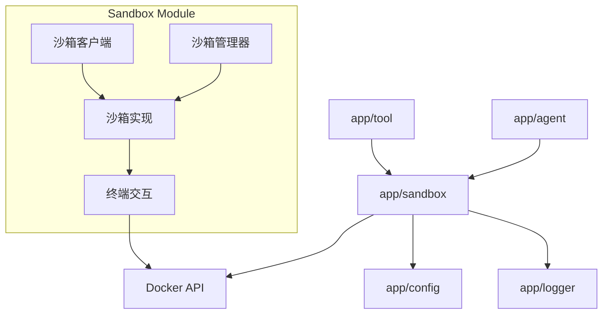
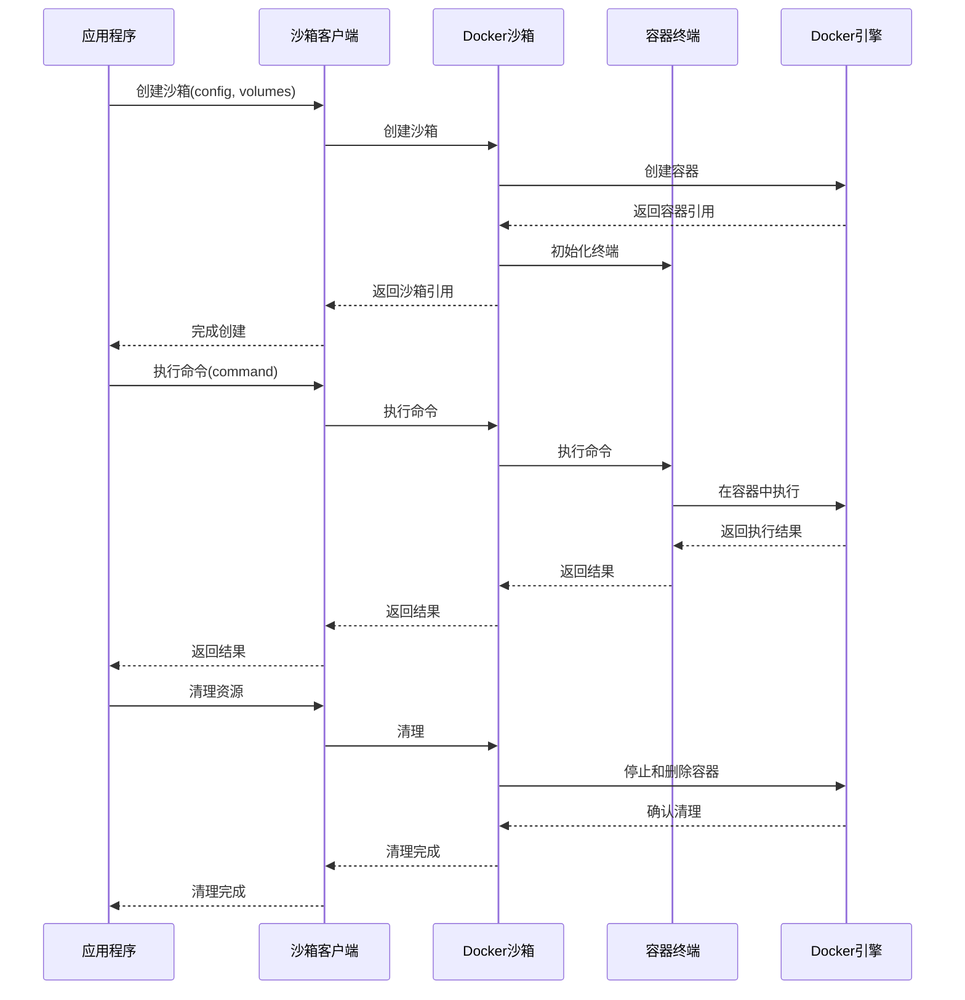

# Sandbox模块文档

## 模块概述

Sandbox（沙箱）模块是OpenManus项目的安全执行环境组件，专门负责在隔离的容器化环境中安全地执行不可信代码和命令。该模块基于Docker实现，提供了资源限制、隔离执行、文件操作和命令运行等核心功能，确保执行环境安全可控且不会影响宿主系统。沙箱模块采用客户端-服务端架构，对上层应用提供简单统一的API，同时在底层实现了复杂的容器生命周期管理、并发控制和资源回收机制。

## 核心组件

### 类层次结构



### 目录结构

```
app/sandbox/
├── __init__.py      # 模块入口点，提供API导出
├── client.py        # 沙箱客户端实现
└── core/            # 核心实现子目录
    ├── exceptions.py  # 沙箱相关异常定义
    ├── manager.py     # 沙箱管理器实现
    ├── sandbox.py     # Docker沙箱实现
    └── terminal.py    # 容器终端交互实现
```

### 主要文件说明

1. **client.py**: 定义了沙箱客户端接口和实现，包括`BaseSandboxClient`抽象基类、`LocalSandboxClient`具体实现和`create_sandbox_client`工厂函数，为上层应用提供了统一的沙箱访问API。

2. **core/sandbox.py**: 实现了`DockerSandbox`类，这是沙箱的核心实现，负责Docker容器的创建、操作和管理，提供了命令执行、文件传输等功能。

3. **core/manager.py**: 实现了`SandboxManager`类，负责管理多个沙箱实例的生命周期，包括创建、监控和清理，提供了并发控制和资源回收机制。

4. **core/terminal.py**: 实现了`AsyncDockerizedTerminal`类，提供与Docker容器进行异步交互的终端接口，负责命令执行和输出处理。

5. **core/exceptions.py**: 定义了沙箱特有的异常类，如`SandboxError`、`SandboxTimeoutError`和`SandboxResourceError`，用于异常处理和错误报告。

## 工作原理

Sandbox模块采用**多层架构**设计，基于Docker实现安全隔离的执行环境：



### 执行流程

1. **沙箱创建**: 
   - 应用程序通过`SANDBOX_CLIENT`单例请求创建沙箱
   - 客户端层调用DockerSandbox的create方法
   - 创建带有资源限制的Docker容器
   - 初始化容器终端接口

2. **命令执行**:
   - 应用程序调用`run_command`方法
   - 命令被传递到容器内执行
   - 执行结果通过终端接口异步返回
   - 支持超时控制和资源限制

3. **文件操作**:
   - 支持`copy_to`、`copy_from`、`read_file`和`write_file`操作
   - 文件通过Docker的内置机制在容器和主机间传输
   - 大文件使用tar打包传输，小文件使用内存流

4. **资源管理**:
   - SandboxManager跟踪所有活动沙箱
   - 定期检查和清理闲置沙箱
   - 限制最大沙箱数量，防止资源耗尽
   - 实现并发控制，避免竞态条件

5. **清理释放**:
   - 使用完毕后调用cleanup方法
   - 停止并移除容器，释放资源
   - 自动清理可能的残留文件和卷

## 模块关系

Sandbox模块与其他模块的关系：



## 数据流向

沙箱操作的数据流动：



## 扩展点

Sandbox模块提供了多个扩展点：

1. **自定义沙箱客户端**: 通过继承`BaseSandboxClient`创建新的客户端实现，例如添加远程沙箱支持。

2. **沙箱配置扩展**: 通过修改`SandboxSettings`类扩展配置选项，支持更多资源限制或安全设置。

3. **沙箱功能增强**: 在`DockerSandbox`中添加新方法，支持更多容器管理功能，如暂停/恢复、快照等。

4. **资源监控扩展**: 增强`SandboxManager`的监控能力，添加资源使用统计和报告功能。

5. **异常处理扩展**: 扩展异常类型，提供更细粒度的错误处理和恢复机制。

## 常见用例

1. **安全执行Python代码**: 在隔离环境中执行用户提供的Python脚本，防止恶意代码影响系统。

2. **命令行工具执行**: 安全地运行命令行工具和脚本，限制资源使用和访问权限。

3. **文件处理和转换**: 在隔离环境中进行文件格式转换、数据处理等操作。

4. **环境隔离测试**: 在隔离环境中测试软件，确保测试不会影响主系统。

5. **临时工作环境**: 为特定任务创建临时工作环境，任务完成后自动清理。

## 代码示例

### 基本沙箱使用

```python
from app.sandbox.client import SANDBOX_CLIENT

async def run_sandboxed_code():
    # 创建沙箱实例
    await SANDBOX_CLIENT.create()
    
    try:
        # 写入Python脚本到沙箱
        await SANDBOX_CLIENT.write_file(
            "/tmp/script.py",
            """
            print("Hello from sandbox!")
            with open('/tmp/output.txt', 'w') as f:
                f.write('Operation completed')
            """
        )
        
        # 执行脚本
        result = await SANDBOX_CLIENT.run_command("python /tmp/script.py")
        print(f"执行结果: {result}")
        
        # 读取生成的文件
        output = await SANDBOX_CLIENT.read_file("/tmp/output.txt")
        print(f"输出文件内容: {output}")
        
    finally:
        # 清理沙箱资源
        await SANDBOX_CLIENT.cleanup()
```

### 高级沙箱配置和使用

```python
from app.config import SandboxSettings
from app.sandbox.client import create_sandbox_client

async def run_customized_sandbox():
    # 创建自定义配置
    config = SandboxSettings(
        memory_limit="256m",
        cpu_limit=0.5,
        network_enabled=False,
        timeout=30
    )
    
    # 卷挂载配置
    volume_bindings = {
        "/path/to/local/data": "/data",  # 挂载本地数据目录
    }
    
    # 创建客户端
    client = create_sandbox_client()
    
    # 创建沙箱
    await client.create(config, volume_bindings)
    
    try:
        # 复制文件到沙箱
        await client.copy_to("local_script.py", "/workspace/script.py")
        
        # 运行命令
        await client.run_command("cd /workspace && python script.py /data/input.json")
        
        # 获取结果
        await client.copy_from("/workspace/results.json", "local_results.json")
        
    finally:
        # 清理资源
        await client.cleanup()
```

### 沙箱管理器使用

```python
from app.sandbox.core.manager import SandboxManager
from app.config import SandboxSettings

async def manage_multiple_sandboxes():
    # 创建沙箱管理器
    manager = SandboxManager(
        max_sandboxes=5,         # 最多5个并发沙箱
        idle_timeout=1800,       # 30分钟闲置超时
        cleanup_interval=300     # 5分钟检查一次
    )
    
    # 确保镜像存在
    await manager.ensure_image("python:3.9-slim")
    
    # 创建多个沙箱
    sandbox_ids = []
    for i in range(3):
        config = SandboxSettings(
            memory_limit=f"{128 * (i+1)}m",
            cpu_limit=0.2 * (i+1)
        )
        sandbox_id = await manager.create_sandbox(config)
        sandbox_ids.append(sandbox_id)
        
    # 使用沙箱
    for sandbox_id in sandbox_ids:
        sandbox = await manager.get_sandbox(sandbox_id)
        await sandbox.run_command("echo 'Running in sandbox'")
        # 释放沙箱（返回到池中，不销毁）
        await manager.release_sandbox(sandbox_id)
    
    # 最终清理所有沙箱
    await manager.cleanup()
```
