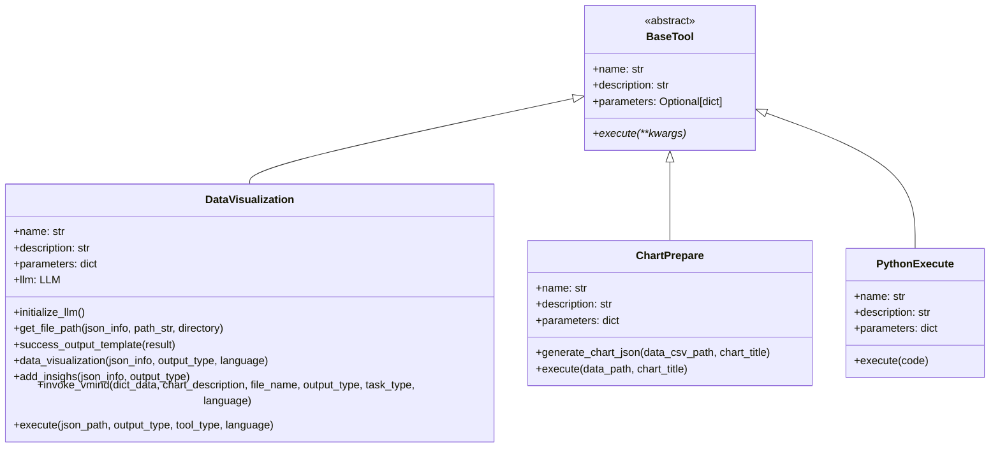
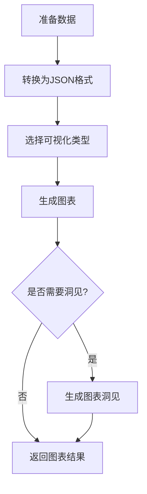
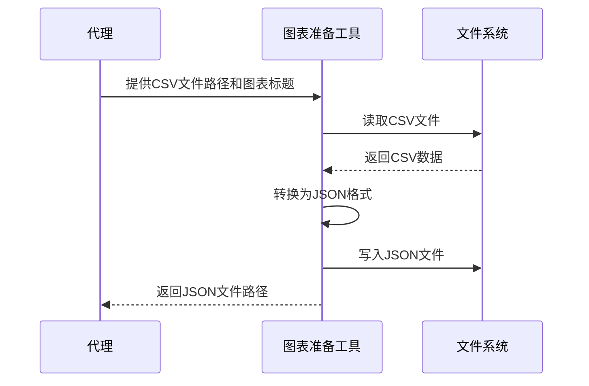
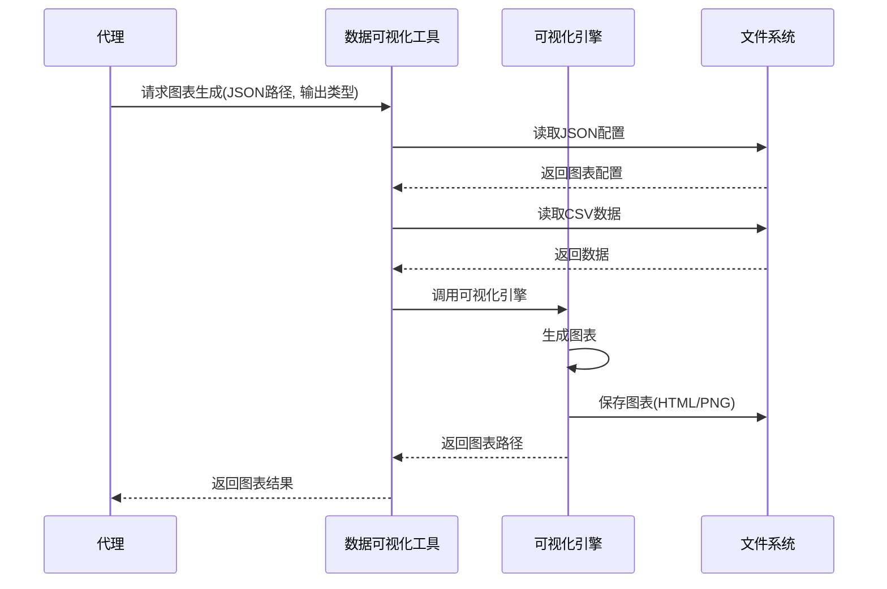
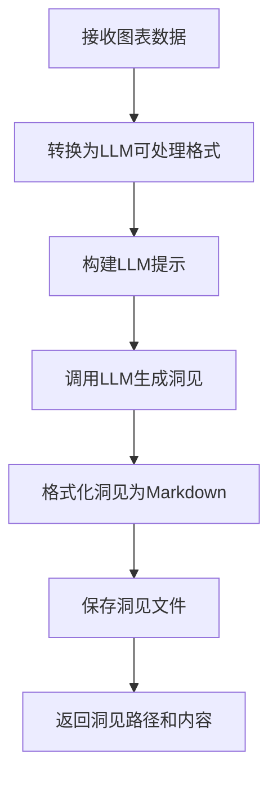
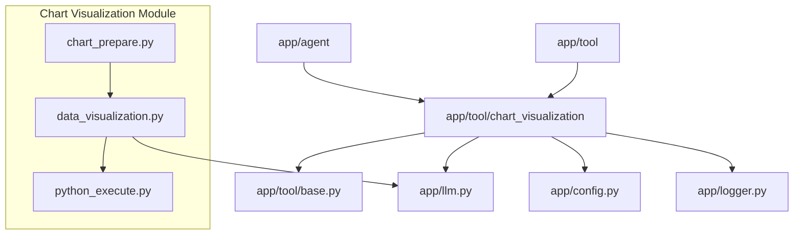
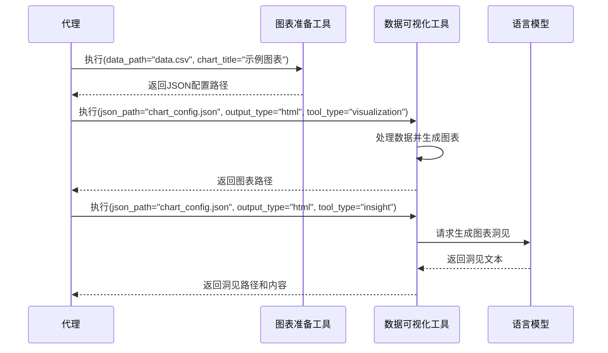

# Chart Visualization模块文档

## 模块概述

Chart Visualization（图表可视化）模块是OpenManus项目的一个专用工具组件，提供了数据可视化和图表洞见分析功能。该模块能够将结构化数据（如CSV文件或JSON数据）转换为各种类型的交互式或静态图表，并可选择性地使用语言模型生成对可视化结果的洞见分析。这使得代理能够以直观的方式呈现数据，辅助用户理解数据中的趋势、模式和关系，提升数据分析和决策支持能力。

## 核心组件

### 类层次结构



### 目录结构

```
app/tool/chart_visualization/
├── __init__.py            # 模块入口，导出主要工具类
├── data_visualization.py  # 数据可视化工具实现
├── chart_prepare.py       # 图表准备工具实现
├── python_execute.py      # 可视化专用Python执行工具
├── README.md              # 英文说明文档
├── README_zh.md           # 中文说明文档
├── package.json           # Node包配置
├── package-lock.json      # Node包锁定文件
├── tsconfig.json          # TypeScript配置
├── src/                   # 前端源代码目录
└── test/                  # 测试目录
```

### 主要工具类

1. **DataVisualization**：核心可视化工具，处理数据并生成图表和洞见。

2. **ChartPrepare**：图表准备工具，用于转换CSV数据为可视化所需的JSON格式。

3. **PythonExecute**：可视化专用Python执行器，提供代码执行环境。

## 工作原理

Chart Visualization模块的工作流程可以分为以下几个主要步骤：



### 1. 数据处理与准备

使用`ChartPrepare`工具，将CSV数据文件转换为标准化的JSON格式，包含图表标题、数据路径等信息：



### 2. 图表生成

使用`DataVisualization`工具，基于JSON配置生成交互式HTML图表或静态PNG图表：



### 3. 洞见生成

可选择性地生成图表洞见，使用LLM分析图表数据，提供见解：



## 功能特点

### 支持的图表类型

Chart Visualization模块支持多种图表类型，包括：

1. **折线图 (Line Chart)**：显示数据随时间或顺序的变化趋势
2. **柱状图 (Bar Chart)**：对比不同类别的数据量
3. **饼图 (Pie Chart)**：显示部分与整体的关系
4. **散点图 (Scatter Plot)**：显示两个变量之间的关系
5. **热力图 (Heat Map)**：通过颜色变化展示数据密度
6. **雷达图 (Radar Chart)**：比较多个定量变量
7. **箱线图 (Box Plot)**：显示数据分布和离散点
8. **复合图表**：组合多种图表类型

### 输出格式选项

模块支持两种主要的输出格式：

1. **HTML**：交互式图表，允许用户悬停、缩放和探索数据
2. **PNG**：静态图片，适合嵌入文档或共享

### 多语言支持

支持两种语言输出：

1. **英文 (en)**：适合国际用户或英文环境
2. **中文 (zh)**：适合中文用户，所有标签和洞见均为中文

## 模块关系

Chart Visualization模块与其他模块的关系：



## 工具调用流程

完整的数据可视化工作流程通常包括以下步骤：



## 代码示例

### 1. 基础图表生成

```python
from app.tool.chart_visualization.chart_prepare import ChartPrepare
from app.tool.chart_visualization.data_visualization import DataVisualization
import asyncio

# 初始化工具
chart_prepare = ChartPrepare()
data_viz = DataVisualization()

# 准备图表JSON配置
async def create_chart():
    # 步骤1: 准备图表配置
    chart_config_result = await chart_prepare.execute(
        data_path="/path/to/data.csv",
        chart_title="月度销售趋势"
    )
    json_path = chart_config_result.output  # 获取JSON配置路径
    
    # 步骤2: 生成图表
    visualization_result = await data_viz.execute(
        json_path=json_path,
        output_type="html",  # 生成交互式HTML图表
        tool_type="visualization",  # 仅生成图表，不生成洞见
        language="zh"  # 使用中文输出
    )
    
    print(visualization_result.output)  # 打印结果信息
    
# 运行示例
asyncio.run(create_chart())
```

### 2. 生成图表并添加洞见

```python
from app.tool.chart_visualization.chart_prepare import ChartPrepare
from app.tool.chart_visualization.data_visualization import DataVisualization
import asyncio

# 初始化工具
chart_prepare = ChartPrepare()
data_viz = DataVisualization()

# 生成图表并添加洞见
async def create_chart_with_insights():
    # 步骤1: 准备图表配置
    chart_config_result = await chart_prepare.execute(
        data_path="/path/to/sales_data.csv",
        chart_title="季度业绩分析"
    )
    json_path = chart_config_result.output
    
    # 步骤2: 生成图表
    viz_result = await data_viz.execute(
        json_path=json_path,
        output_type="html",
        tool_type="visualization",
        language="en"  # 使用英文输出
    )
    
    # 步骤3: 生成图表洞见
    insight_result = await data_viz.execute(
        json_path=json_path,
        output_type="html",
        tool_type="insight",  # 生成洞见
        language="en"
    )
    
    print("图表路径:", viz_result.output)
    print("洞见内容:", insight_result.output)
    
# 运行示例
asyncio.run(create_chart_with_insights())
```

### 3. 批量处理多个数据集

```python
from app.tool.chart_visualization.chart_prepare import ChartPrepare
from app.tool.chart_visualization.data_visualization import DataVisualization
import asyncio
import os

# 初始化工具
chart_prepare = ChartPrepare()
data_viz = DataVisualization()

# 批量处理多个数据集
async def batch_process_charts():
    # 数据源和图表标题配置
    data_sources = [
        {"path": "/path/to/sales.csv", "title": "销售趋势"},
        {"path": "/path/to/users.csv", "title": "用户增长"},
        {"path": "/path/to/revenue.csv", "title": "收入分析"}
    ]
    
    # 创建图表配置
    json_paths = []
    for source in data_sources:
        result = await chart_prepare.execute(
            data_path=source["path"],
            chart_title=source["title"]
        )
        json_paths.append(result.output)
    
    # 批量生成图表
    chart_results = []
    for json_path in json_paths:
        result = await data_viz.execute(
            json_path=json_path,
            output_type="png",  # 生成静态PNG图表
            tool_type="visualization",
            language="zh"
        )
        chart_results.append(result.output)
    
    return chart_results
    
# 运行批量处理
asyncio.run(batch_process_charts())
```

## 扩展点

Chart Visualization模块设计了多个扩展点，便于未来功能增强：

1. **新图表类型**：可以扩展支持更多的图表类型，如地图、树状图、桑基图等。

2. **自定义样式主题**：添加更多的图表样式和主题选项。

3. **数据预处理功能**：添加更多数据转换和预处理功能，如数据规范化、异常值检测等。

4. **增强洞见分析**：改进LLM提示，提供更深入的数据分析和建议。

5. **导出更多格式**：支持更多输出格式，如PDF、SVG或交互式仪表板。

## 最佳实践

### 数据准备建议

1. **数据清洗**：确保CSV数据已经过清洗，无缺失值或异常值。

2. **数据格式**：遵循标准CSV格式，使用UTF-8编码避免中文乱码。

3. **列名规范**：使用清晰、简洁的列名，避免特殊字符。

4. **数据量控制**：对于复杂图表，控制数据量在合理范围内（通常不超过1000行）。

### 图表选择指南

1. **趋势分析**：使用折线图显示数据随时间的变化。

2. **比较分析**：使用柱状图或条形图对比不同类别的值。

3. **分布分析**：使用散点图、直方图或箱线图展示数据分布。

4. **构成分析**：使用饼图或环图展示部分与整体的关系。

5. **相关性分析**：使用散点图或热力图展示变量间的相关性。

### 洞见生成技巧

1. **明确图表目的**：在图表标题中明确指出分析目的，帮助LLM生成更相关的洞见。

2. **选择合适的语言**：根据目标受众选择合适的语言（中文或英文）。

3. **结合业务上下文**：提供充分的业务背景信息，获得更有价值的洞见。
