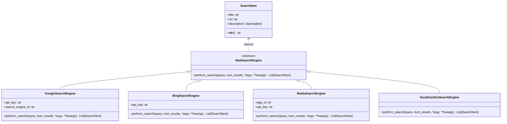
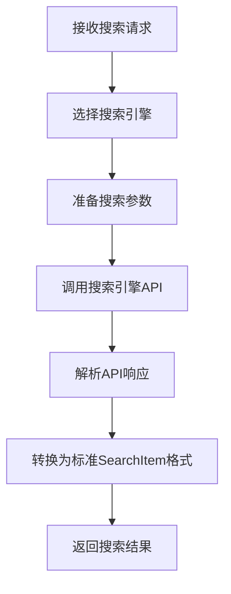
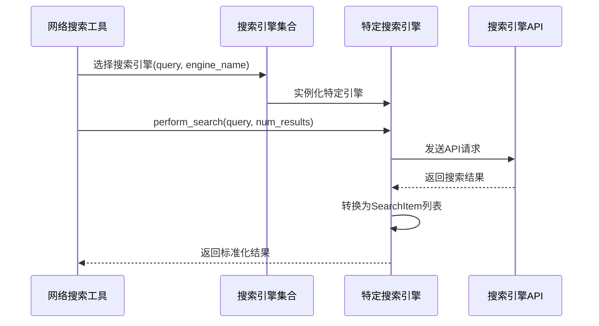

# 搜索模块文档

## 模块概述

搜索（Search）模块是OpenManus项目的一个重要组件，提供了跨多个搜索引擎进行网络搜索的能力。该模块采用可扩展的设计，定义了统一的搜索接口和数据模型，同时提供了多个搜索引擎的具体实现（Google、Bing、百度、DuckDuckGo），使代理能够获取实时的网络信息，回答用户问题，或收集研究数据。搜索结果以标准化的格式返回，便于代理进行进一步处理和分析。

## 核心组件

### 类层次结构



### 目录结构

```
app/tool/search/
├── __init__.py           # 模块入口，导出搜索引擎类
├── base.py               # 定义基础搜索模型和引擎接口
├── google_search.py      # Google搜索引擎实现
├── bing_search.py        # Bing搜索引擎实现
├── baidu_search.py       # 百度搜索引擎实现
└── duckduckgo_search.py  # DuckDuckGo搜索引擎实现
```

### 主要类说明

1. **SearchItem**：表示单个搜索结果项的数据模型，包含标题、URL和描述。

2. **WebSearchEngine**：所有搜索引擎的抽象基类，定义了统一的搜索接口。

3. **GoogleSearchEngine**：谷歌搜索引擎实现，使用Google Custom Search JSON API。

4. **BingSearchEngine**：微软必应搜索引擎实现，使用Bing Search API。

5. **BaiduSearchEngine**：百度搜索引擎实现，使用百度搜索API。

6. **DuckDuckGoSearchEngine**：DuckDuckGo搜索引擎实现，使用第三方库进行搜索。

## 工作原理

搜索模块的工作流程如下：



### 搜索流程详解

1. **接收搜索请求**：代理或工具调用搜索功能，提供搜索查询和参数。

2. **选择搜索引擎**：根据配置或调用参数选择适当的搜索引擎实现。

3. **准备搜索参数**：根据不同搜索引擎的要求格式化参数。

4. **调用搜索引擎API**：发送HTTP请求到相应的搜索引擎API。

5. **解析API响应**：处理返回的JSON或HTML内容。

6. **转换为标准格式**：将搜索引擎特定的响应格式转换为统一的`SearchItem`对象列表。

7. **返回搜索结果**：将标准化的搜索结果返回给调用者。

### 搜索引擎选择与参数处理



## 模块关系

搜索模块与其他模块的关系：

```mermaid
graph TD
    Search[app/tool/search] --> HTTPClient[HTTP客户端库]
    Tool[app/tool] --> Search
    WebSearch[app/tool/web_search.py] --> Search
    Agent[app/agent] --> WebSearch
    
    subgraph "Search Module"
        Base[base.py]
        Google[google_search.py]
        Bing[bing_search.py]
        Baidu[baidu_search.py]
        DuckDuckGo[duckduckgo_search.py]
    end
    
    Base <-- Google
    Base <-- Bing
    Base <-- Baidu
    Base <-- DuckDuckGo
```

## 各搜索引擎特点

### Google搜索引擎

- **API**: 使用Google Custom Search JSON API
- **认证**: 需要API密钥和自定义搜索引擎ID
- **特点**: 结果全面，可定制搜索范围，支持过滤器
- **限制**: 免费账户有每日请求限制

### Bing搜索引擎

- **API**: 使用Bing Search API v7
- **认证**: 需要Microsoft Azure API密钥
- **特点**: 支持网页、图像、新闻、视频等多种搜索
- **限制**: 有每秒查询率和每月查询量限制

### 百度搜索引擎

- **API**: 使用百度搜索API
- **认证**: 需要百度开发者平台的API密钥和应用ID
- **特点**: 对中文内容支持良好，中国地区访问速度快
- **限制**: 有每日API调用次数限制

### DuckDuckGo搜索引擎

- **实现**: 使用第三方库或直接抓取
- **认证**: 无需API密钥
- **特点**: 注重隐私，不跟踪用户，结果不个性化
- **限制**: 可能受到DuckDuckGo反自动化措施的限制

## 搜索参数定制

各搜索引擎支持的常见参数：

| 参数名 | 说明 | Google | Bing | 百度 | DuckDuckGo |
|-------|------|--------|------|------|------------|
| query | 搜索查询 | ✓ | ✓ | ✓ | ✓ |
| num_results | 结果数量 | ✓ | ✓ | ✓ | ✓ |
| language | 语言偏好 | ✓ | ✓ | ✓ | ✓ |
| country/region | 地区筛选 | ✓ | ✓ | ✓ | ✓ |
| safe_search | 安全搜索 | ✓ | ✓ | ✓ | ✓ |
| site | 指定站点 | ✓ | ✓ | ✓ | ✓ |
| file_type | 文件类型 | ✓ | ✓ | ✓ | ✗ |
| time_period | 时间范围 | ✓ | ✓ | ✓ | ✗ |

## 扩展点

搜索模块设计了多个扩展点，方便未来功能增强：

1. **添加新搜索引擎**：只需继承`WebSearchEngine`基类并实现`perform_search`方法。

2. **增强搜索结果模型**：可以扩展`SearchItem`类添加更多属性，如来源评分、内容类型等。

3. **高级搜索特性**：添加更多搜索参数和过滤器支持。

4. **缓存层**：可以添加搜索结果缓存，减少API调用。

5. **结果聚合**：实现跨多个搜索引擎的结果合并和排序。

## 代码示例

### 1. 使用特定搜索引擎

```python
from app.tool.search.google_search import GoogleSearchEngine

# 初始化Google搜索引擎
google_search = GoogleSearchEngine(
    api_key="YOUR_API_KEY",
    search_engine_id="YOUR_SEARCH_ENGINE_ID"
)

# 执行搜索
async def search_example():
    results = await google_search.perform_search(
        query="人工智能发展",
        num_results=5,
        language="zh"
    )
    
    for item in results:
        print(f"标题: {item.title}")
        print(f"URL: {item.url}")
        print(f"描述: {item.description}")
        print("---")
```

### 2. 在WebSearch工具中使用多个搜索引擎

```python
from app.tool.search.google_search import GoogleSearchEngine
from app.tool.search.bing_search import BingSearchEngine
from app.tool.search.baidu_search import BaiduSearchEngine

# 初始化多个搜索引擎
search_engines = {
    "google": GoogleSearchEngine(api_key="...", search_engine_id="..."),
    "bing": BingSearchEngine(api_key="..."),
    "baidu": BaiduSearchEngine(app_id="...", api_key="...")
}

# 选择引擎执行搜索
async def web_search(query, engine_name="google", num_results=5):
    if engine_name not in search_engines:
        raise ValueError(f"不支持的搜索引擎: {engine_name}")
    
    engine = search_engines[engine_name]
    results = await engine.perform_search(query, num_results)
    
    return results
```

### 3. 搜索引擎轮询（失败后尝试其他引擎）

```python
from app.tool.search.google_search import GoogleSearchEngine
from app.tool.search.bing_search import BingSearchEngine
from app.tool.search.duckduckgo_search import DuckDuckGoSearchEngine

# 初始化搜索引擎列表
engines = [
    GoogleSearchEngine(api_key="...", search_engine_id="..."),
    BingSearchEngine(api_key="..."),
    DuckDuckGoSearchEngine()
]

# 轮询多个搜索引擎
async def fallback_search(query, num_results=5):
    errors = []
    
    for engine in engines:
        try:
            results = await engine.perform_search(query, num_results)
            if results:
                return results
        except Exception as e:
            engine_name = engine.__class__.__name__
            errors.append(f"{engine_name}: {str(e)}")
            continue
    
    # 所有引擎都失败
    raise Exception(f"所有搜索引擎都失败: {', '.join(errors)}")
```

## 性能优化与使用建议

1. **选择合适的搜索引擎**：
   - Google提供全面但有配额限制
   - Bing适合需要多种内容类型的情况
   - 百度对中文内容有优势
   - DuckDuckGo无需API密钥，但功能相对简单

2. **优化搜索参数**：
   - 使用`site:`筛选特定网站
   - 设置适当的`num_results`，避免获取过多不必要的结果
   - 指定`language`提高结果相关性

3. **错误处理建议**：
   - 实现请求重试机制
   - 提供搜索引擎故障转移
   - 为配额限制实现延迟或节流策略

4. **缓存考虑**：
   - 对于短期内重复的查询，考虑实现结果缓存
   - 根据数据新鲜度要求设置合适的缓存过期时间

## 常见问题排查

1. **认证错误**：
   - 检查API密钥是否正确
   - 确认API密钥有足够的权限
   - 验证服务账号是否激活

2. **配额/限流错误**：
   - 检查API用量配额
   - 实现请求延迟或节流
   - 考虑升级API计划或分散到多个密钥

3. **结果质量问题**：
   - 优化搜索查询语法
   - 尝试不同的搜索引擎
   - 调整语言和区域设置

4. **连接问题**：
   - 检查网络连接
   - 确认API端点是否可访问
   - 考虑使用HTTP代理
