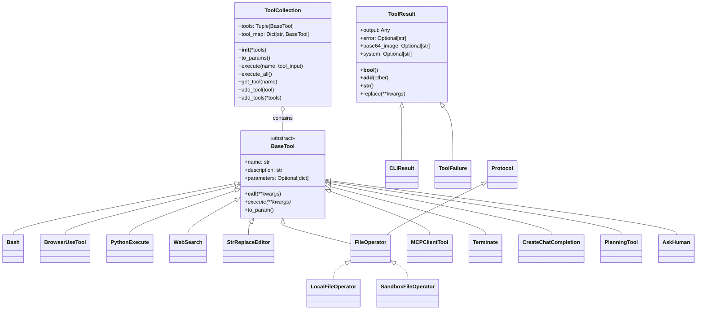
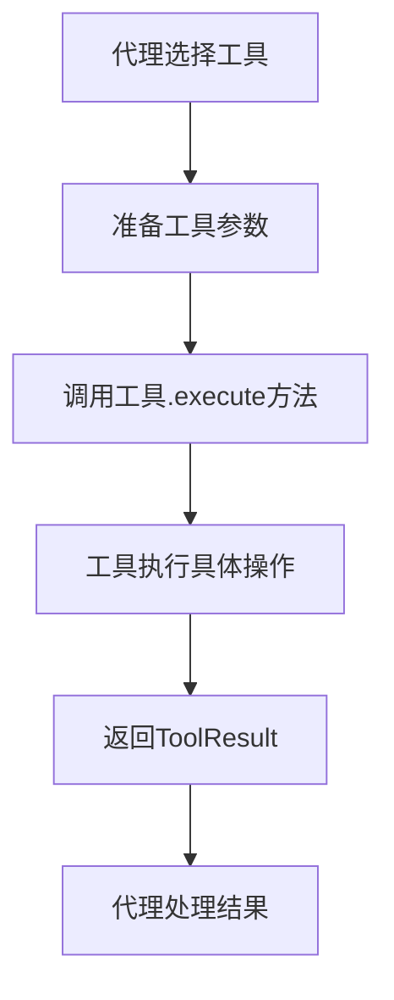
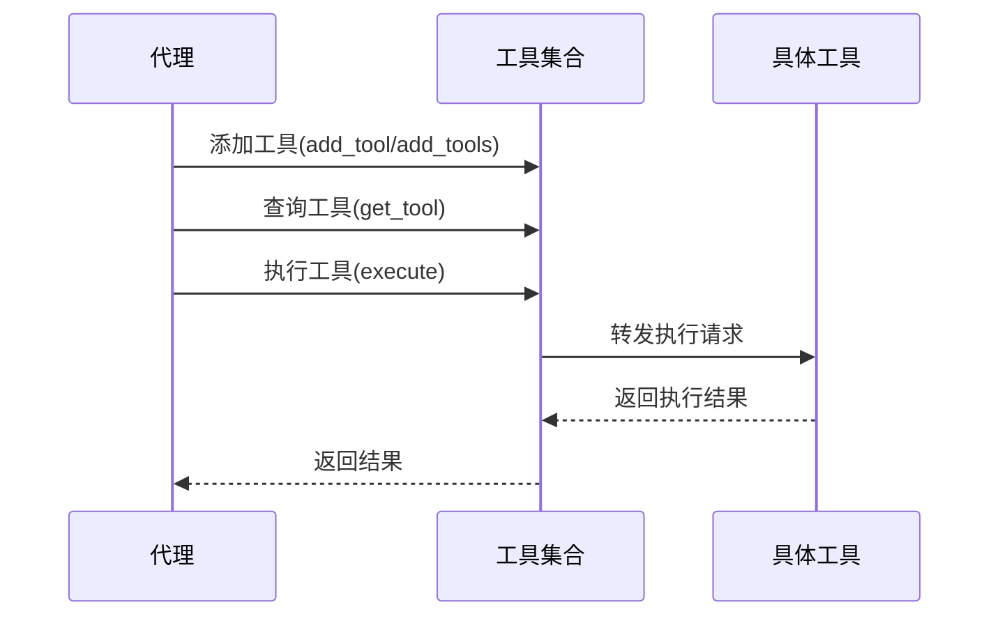
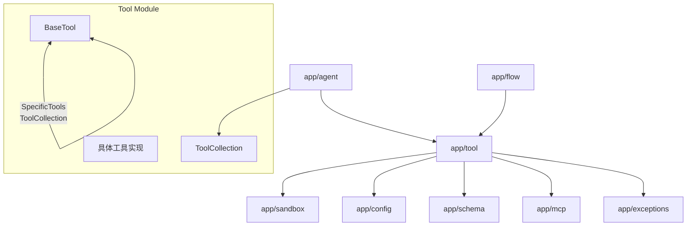
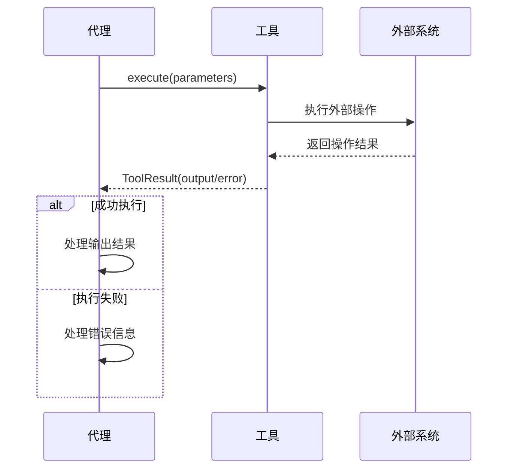

# Tool模块文档

## 模块概述

Tool（工具）模块是OpenManus项目的功能执行核心，提供了丰富的工具集，使代理（Agent）能够与外部世界交互、执行各种任务和操作。该模块采用统一的接口设计，每个工具都继承自BaseTool基类，这种设计使得系统可以轻松扩展新的工具，同时保持使用接口的一致性。工具模块支持文件操作、命令执行、网络搜索、数据可视化、代码执行等多种功能，还可以通过MCP（模型上下文协议）连接到外部工具服务。工具的执行结果通过标准化的ToolResult类返回，便于代理统一处理不同工具的输出。

## 核心组件

### 类层次结构



### 目录结构

```
app/tool/
├── __init__.py           # 模块入口，导出主要工具类
├── base.py               # 定义基础工具类和结果模型
├── tool_collection.py    # 工具集合类，管理多个工具
├── bash.py               # Bash命令执行工具
├── python_execute.py     # Python代码执行工具
├── web_search.py         # 网络搜索工具
├── browser_use_tool.py   # 浏览器自动化工具
├── file_operators.py     # 文件操作工具
├── str_replace_editor.py # 文本替换编辑器
├── terminate.py          # 终止操作工具
├── mcp.py                # MCP工具客户端
├── planning.py           # 计划创建和管理工具
├── create_chat_completion.py # 聊天完成工具
├── ask_human.py          # 询问人类工具
├── search/               # 搜索工具子模块目录
│   ├── __init__.py       # 搜索子模块入口
│   ├── base.py           # 搜索引擎基类
│   ├── google_search.py  # Google搜索引擎实现
│   ├── bing_search.py    # Bing搜索引擎实现
│   ├── baidu_search.py   # 百度搜索引擎实现
│   └── duckduckgo_search.py # DuckDuckGo搜索引擎实现
└── chart_visualization/  # 数据可视化工具子模块目录
    ├── __init__.py       # 可视化子模块入口
    ├── data_visualization.py # 数据可视化核心
    ├── chart_prepare.py  # 图表准备工具
    ├── python_execute.py # 可视化专用Python执行器
    └── ... (其他支持文件)
```

### 主要工具类

1. **BaseTool**：所有工具的抽象基类，定义了工具的基本接口和属性。

2. **ToolCollection**：管理多个工具的集合类，提供工具查询、添加和执行的统一接口。

3. **Bash**：用于执行Bash命令的工具，支持长时间运行、交互式命令和超时控制。

4. **PythonExecute**：在受控环境中安全执行Python代码的工具，使用多进程隔离和超时控制。

5. **WebSearch**：跨多个搜索引擎执行网络搜索的工具，支持Google、Bing、DuckDuckGo和百度。

6. **BrowserUseTool**：浏览器自动化工具，可以导航网页、点击按钮、填表单和提取内容。

7. **FileOperator**：文件操作接口，有本地（LocalFileOperator）和沙箱（SandboxFileOperator）两种实现。

8. **StrReplaceEditor**：文本替换编辑器，用于文本文件的结构化修改。

9. **MCPClientTool**：MCP（模型上下文协议）工具，用于连接外部工具服务器。

10. **PlanningTool**：计划创建和管理工具，用于规划类代理的执行流程管理。

11. **Terminate**：终止操作工具，用于结束代理的执行循环。

12. **AskHuman**：询问人类用户的工具，用于处理代理无法自行决策的情况。

## 工作原理

Tool模块基于**命令-执行-返回**的模式工作，提供了一个统一的异步接口：



### 工具执行流程

1. **工具选择**：代理基于当前任务需求选择合适的工具。

2. **参数准备**：代理根据工具的`parameters`模式准备必要的参数。

3. **工具调用**：调用工具的`execute`方法，传入准备好的参数。

4. **执行操作**：工具执行具体的操作，可能涉及文件系统、网络请求、命令执行等。

5. **结果返回**：工具将执行结果包装为`ToolResult`对象返回。

6. **结果处理**：代理解析结果，决定下一步操作。

### 工具集合管理

`ToolCollection`类实现了工具的组织和批量管理：



## 模块关系

Tool模块与其他模块的关系：



## 数据流向

工具执行过程中的数据流动：



## 扩展点

Tool模块提供了多个扩展点：

1. **创建新工具**：继承`BaseTool`类并实现`execute`方法，可以创建新的工具。

2. **扩展搜索引擎**：继承`WebSearchEngine`基类，可以添加新的搜索引擎支持。

3. **文件操作扩展**：实现`FileOperator`协议，可以支持新的文件系统操作模式。

4. **MCP工具集成**：通过`MCPClients`类，可以连接到新的MCP服务器，增加更多远程工具。

5. **可视化扩展**：通过扩展`chart_visualization`子模块，可以支持新的数据可视化类型。

## 常见用例

1. **文件操作**：使用`FileOperator`读写文件，在本地或沙箱环境中。

2. **命令执行**：使用`Bash`工具执行系统命令，获取输出结果。

3. **代码执行**：使用`PythonExecute`工具执行Python代码，实现动态计算。

4. **网络搜索**：使用`WebSearch`工具获取实时网络信息，回答用户问题。

5. **浏览器自动化**：使用`BrowserUseTool`工具自动完成网页导航、表单填写等任务。

6. **数据可视化**：使用`chart_visualization`相关工具将数据转换为可视化图表。

7. **任务规划**：使用`PlanningTool`创建和管理任务执行计划。

8. **远程工具调用**：使用`MCPClientTool`连接到外部工具服务器，扩展功能集。

## 代码示例

### 创建和使用自定义工具

```python
from app.tool.base import BaseTool, ToolResult
from app.tool.tool_collection import ToolCollection

# 定义自定义工具
class CalculatorTool(BaseTool):
    name = "calculator"
    description = "执行简单的数学计算"
    parameters = {
        "type": "object",
        "properties": {
            "expression": {
                "type": "string",
                "description": "要计算的数学表达式，例如 '1 + 2'",
            }
        },
        "required": ["expression"]
    }
    
    async def execute(self, expression: str) -> ToolResult:
        try:
            # 安全地执行表达式计算
            result = eval(expression, {"__builtins__": {}}, {})
            return ToolResult(output=f"计算结果: {result}")
        except Exception as e:
            return ToolResult(error=f"计算错误: {str(e)}")

# 创建工具集合
tools = ToolCollection(CalculatorTool())

# 执行工具
async def run_calculator():
    result = await tools.execute(name="calculator", tool_input={"expression": "2 * 3 + 4"})
    print(result.output)  # 输出: 计算结果: 10
```

### 组合多个工具

```python
from app.tool import Bash, PythonExecute, WebSearch
from app.tool.tool_collection import ToolCollection

# 创建包含多个工具的集合
tools = ToolCollection(
    Bash(),
    PythonExecute(),
    WebSearch()
)

# 顺序执行多个工具
async def process_data():
    # 1. 使用Bash下载数据
    download_result = await tools.execute(
        name="bash", 
        tool_input={"command": "curl -s https://example.com/data.csv > data.csv"}
    )
    
    # 2. 使用Python处理数据
    process_result = await tools.execute(
        name="python_execute",
        tool_input={
            "code": """
            import pandas as pd
            
            # 读取CSV文件
            df = pd.read_csv('data.csv')
            
            # 进行数据处理
            processed = df.groupby('category').mean()
            
            # 保存结果
            processed.to_csv('results.csv')
            
            print(f"处理了 {len(df)} 条记录，生成了 {len(processed)} 个类别的统计")
            """
        }
    )
    
    # 3. 使用网络搜索获取补充信息
    search_result = await tools.execute(
        name="web_search",
        tool_input={"query": "数据分析最佳实践", "num_results": 3}
    )
    
    return {
        "download": download_result,
        "process": process_result,
        "search": search_result
    }
```

### 使用文件操作工具

```python
from app.tool.file_operators import LocalFileOperator, SandboxFileOperator

# 本地文件操作
async def local_file_demo():
    file_op = LocalFileOperator()
    
    # 写入文件
    await file_op.write_file(
        "example.txt", 
        "这是一个示例文件内容\n包含多行文本"
    )
    
    # 读取文件
    content = await file_op.read_file("example.txt")
    print(f"文件内容: {content}")
    
    # 检查路径
    is_dir = await file_op.is_directory("/tmp")
    print(f"/tmp 是目录: {is_dir}")
    
    # 执行命令
    exit_code, stdout, stderr = await file_op.run_command("ls -la")
    print(f"命令输出: {stdout}")

# 沙箱文件操作
async def sandbox_file_demo():
    file_op = SandboxFileOperator()
    
    # 写入沙箱中的文件
    await file_op.write_file(
        "/workspace/example.txt", 
        "这是沙箱中的示例文件内容"
    )
    
    # 读取沙箱中的文件
    content = await file_op.read_file("/workspace/example.txt")
    print(f"沙箱文件内容: {content}")
    
    # 在沙箱中执行命令
    exit_code, stdout, stderr = await file_op.run_command("uname -a")
    print(f"沙箱系统信息: {stdout}")
```
